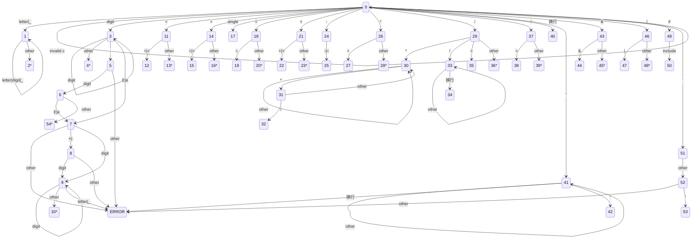

# 编译原理实验报告

| **姓名** |                  **梁睿凯**                  |
| :------: | :------------------------------------------: |
| **学号** |                 **19335121**                 |
| **专业** | **计算机科学与技术（人工智能与大数据方向）** |
| **日期** |                **2022/03/05**                |

[TOC]

## 一、实验要求

设计C语言词法分析程序，实现输入一个C语言源程序，输出一个文件token.txt，该文件包括每一个单词及其种类枚举值。

## 二、程序设计

### 2.1	语言说明

- 标识符：以字母或下划线开头且由字母、数字、下划线组成的符号串。
- 关键字（C语言常用的32个关键字）。
- 无符号数：包括整数、小数、以及指数。
- 关系运算符：<，<=，>，>=，==，!=，&&，||。
- 算数运算符：+，+=，-，-=，=，/，/=，%。
- 逻辑运算符：&，|，！，^，~，?。
- 界符：（，），{，}，[，]，;，,，：。
- 注释标记：以“/\*”开始，以“\*/” 结束；“//”
- 头文件：形如"XXX.h"

### 2.2	对应种别码

| 单词符号 | 种别码 |
| :------: | :----: |
|  标识符  |   0    |
|   字符   |   1    |
|  字符串  |   2    |
|   数字   |   3    |
|   auto   |   4    |
|  short   |   5    |
|   int    |   6    |
|  float   |   7    |
|  double  |   8    |
|   char   |   9    |
|  struct  |   10   |
|  union   |   11   |
|   enum   |   12   |
| typedef  |   13   |
|  const   |   14   |
| unsigned |   15   |
|  extern  |   16   |
| register |   17   |
|  static  |   18   |
| volatile |   19   |
|   void   |   20   |
|    if    |   21   |
|   else   |   22   |
|  switch  |   23   |
|   case   |   24   |
|   for    |   25   |
|    do    |   26   |
|  while   |   27   |
|   goto   |   28   |
| continue |   29   |
|  break   |   30   |
| default  |   31   |
|  sizeof  |   32   |
|  return  |   33   |
|   long   |   34   |
|  signed  |   35   |
|    <     |   36   |
|    <=    |   37   |
|    <<    |   38   |
|    >     |   39   |
|    >=    |   40   |
|    >>    |   41   |
|    ?     |   42   |
|    :     |   43   |
|    ^     |   44   |
|    %     |   45   |
|    (     |   46   |
|    )     |   47   |
|    [     |   48   |
|    ,     |   49   |
|    ;     |   50   |
|    ~     |   51   |
|    =     |   52   |
|    ==    |   53   |
|    +     |   54   |
|    +=    |   55   |
|    -     |   56   |
|    -=    |   57   |
|    *     |   58   |
|    *=    |   59   |
|    !=    |   60   |
|    &     |   61   |
|    &&    |   62   |
|    \|    |   63   |
|   \|\|   |   64   |
|  头文件  |   65   |
|    ]     |   66   |
|    {     |   67   |
|    }     |   68   |

### 2.3	状态转化图（自动机）设计

1. 在开始状态时，首先需要读入一个合法字符，若为空格或tab等非法字符则跳过，继续读字符。
2. 若读入字符为_或字母则进入标识符状态分支，最后还需要查表确定是否为关键字。
3. 若读入字符为数字则进入无符号数状态分支，通过一系列状态转移判断为小数、整数、指数。
4. 在‘<’状态，若读进的下一个字符是“=”,则输出关系运算符“<=”;若读进的下一个字符是“<”,则输出关系运算符“<<”;否则输出关系运算符“<”。
5. 在“/”状态，若读进的下一个字符是’*‘ 则进人注释处理状态，词法分析程序要做的工作是跳过注释,具体做法就是不断地读字符,直到遇到“*/”为止，然后转开始状态，继续识别和分析下一个单词;若读进的下一个字符不是“*”,而是“/”，那么即为双斜杠注释符，跳过注释，直到读到该行的回车符，再进行新的字符的读入；如读入的是“=”,那么即为“/=”;否则则输出斜杠“/”。
6. 在“!”状态﹐若读进的下一个字符是“=”,则输出不等号“!=”;否则，输出感叹号“！”。
7. 在“=”状态﹐若读进的下一个字符是“=”,则输出相等号“==”;否则，输出等号“=”。
8. 在“+”状态﹐若读进的下一个字符是“=”,则输出“+=”;否则，输出“+”。
9. 在“-”状态﹐若读进的下一个字符是“=”,则输出“-=”;否则，输出“-”。
10. 在“*”状态﹐若读进的下一个字符是“=”,则输出“*=”;否则，输出“*”。
11. 在“\n”状态﹐将行数加一，并跳转到新的开始进行读取字符。
12. 在“&”状态﹐若读进的下一个字符是“&”,则输出“&&”;否则，输出“&”。
13. 在“|”状态﹐若读进的下一个字符是“|”,则输出“||”;否则，输出“|”。
14. 在“#”状态﹐若读进的下一个字符串是“include”，则进入头文件的处理。
15. 若进入错误处理状态，表示词法分析程序从源程序中读入了一个不合法的字符。所谓不合法的字符是指该语言不包括以此字符开头的单词符号。词法分析程序发现不合法字符时，要做错误处理,其主要工作是记录改错行与打印错误信息。 
16. 
17. 在其他标点符号（single）状态，只需输出其相应的记号即可。
18. 如果读取的字符是文件结束符，那么即退出词法分析程序，结束分析。

> - 带*的终止状态节点表示需要回退文件指针
> - letter表示所有英文字母，digit表示所有数字，single表示一些只存在一位的运算符或界符，invalid c表示非法字符，如空格，tab等。
> - ERROR状态表示错误处理，对应会记录错误出现的行号

### 2.4	源代码说明

- `state`：整形变量，记录当前状态
- `buff`：字符变量，存取当前读取的字符
- `map<string,int> dict`：存取对应种别码
- `vector<pair<string,int>>wordlist`：存取源程序的单词及种别
- `vector<int> errorline`: 保存错误词法行数
- `bool isLetter(char ch)`：判断字符是否为字母
- `bool isDigit(char ch)`：判断字符是否为数字
- `bool isKey(string word)`：判断单词是否为关键字
- `void error()`：错误处理（记录当前错误的行号，并且跳过当前字符）
- `bool isSingle(char ch)`：判断是否是单个运算符或界符
- `void addWordBack(ifstream &file, string &word)`：添加单词并回退指针
- `void addWord(string &word)` ：添加单词但不回退指针
- `void initMAP()`：初始化词种别对应表
- `void scanDFA(string filename)`：词法分析主程序

### 2.5	设计细节

1. 错误处理（通过设置ERROR状态，用以保存出错的行数）
   1. 数字书写错误
   2. 字符串，或字符错误（只有前引号）
2. 头文件处理（仅设置支持<>格式，方式采取即为仅读取<>内的单词为头文件）
3. 注释处理
   1. /**/格式通过前后匹配方式跳过中间的所有字符
   2. //格式跳过该行的所有字符

## 三、运行结果

### 3.1	词法错误程序

见`src/demo_error.c`

运行结果：

分析错误正确！

### 3.2	词法正确程序

见`src/demo.c`

运行结果：

见`src/tokens.txt`

对比种别码表可以得出词法分析正确

## 四、实验总结

本次实验实现了针对C语言较为基础的词法分析器，实验主要工作为建立DFA自动机实现对各种单词的识别，而代码的实现主要是通过switch条件语句控制状态转移。也可以看到代码中大部分篇章为各种case中的处理。总的来说算法实现并不难，也为以后的实验完成打下了坚实的基础。

